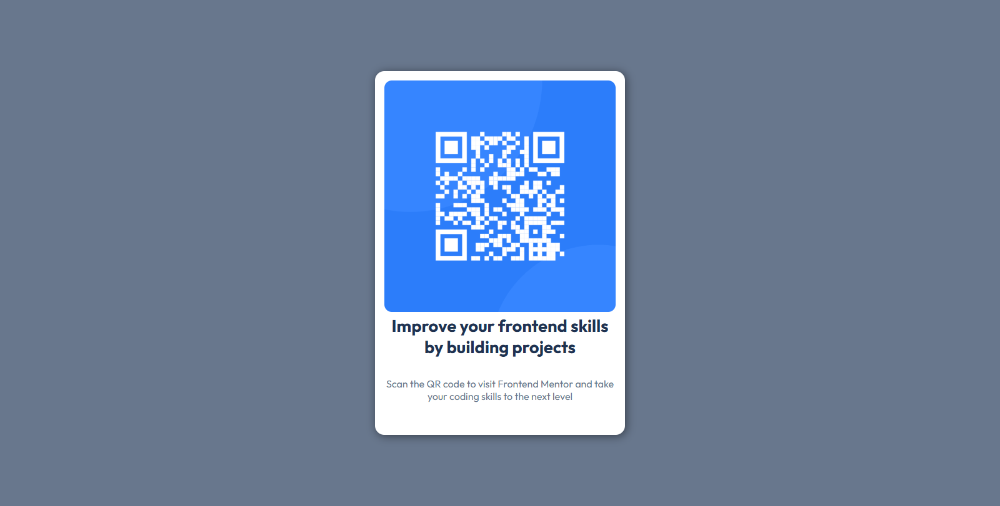

# Frontend Mentor - QR Code Component Solution

This is my solution for the **QR Code Component** challenge on [Frontend Mentor](https://www.frontendmentor.io). Frontend Mentor challenges help developers improve their coding skills by building realistic projects.

## 🎯 Overview

### The Challenge

Users should be able to:

- ✅ View the optimal layout based on their device screen size.
- ✅ See a QR code and descriptive text styled correctly.

### Screenshot

### Links

- 🌐 **Live Site:** [View Live Demo](https://qr-code-img.onrender.com)
- 💾 **Solution URL:** [Frontend Mentor Submission](https://www.frontendmentor.io/solutions/card-sizing-using-flexbox-html-and-css-code-RegZghJUHT)

---

## 🔨 My Process

### Built With

- HTML5 & CSS3
- Flexbox for layout
- Mobile-first workflow

### What I Learned

- ✨ How to center a div perfectly using `display: flex;`
- ✨ Improved my understanding of `box-shadow` for styling cards.

### Useful Resources

- [CSS Tricks: Flexbox Guide](https://css-tricks.com/snippets/css/a-guide-to-flexbox/) - Helped me understand flexbox better.
- [MDN Web Docs - Box Shadow](https://developer.mozilla.org/en-US/docs/Web/CSS/box-shadow) - Great explanation of shadow effects.

---

## 👨‍💻 Author

- Frontend Mentor - [@Vortex105](https://www.frontendmentor.io/profile/Vortex105)
- GitHub - [@Vortex105](https://github.com/Vortex105)
